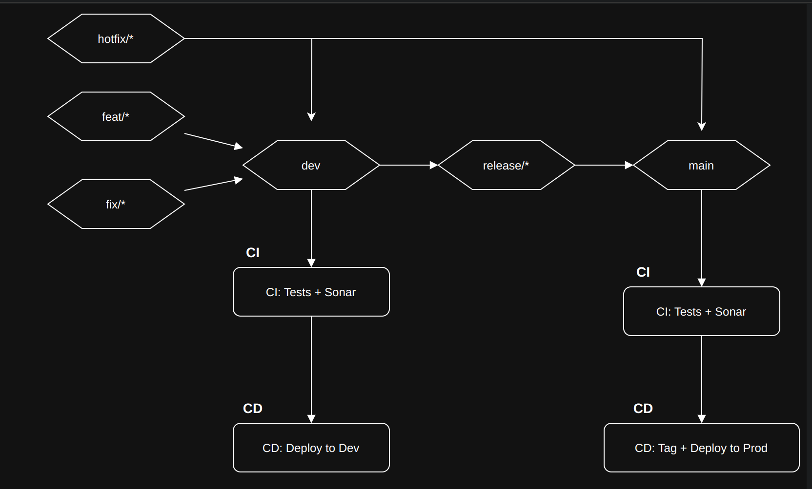

# Git Flow + CI/CD Pipeline

This repository documents a Git branching strategy and a CI/CD pipeline designed for modern backend development workflows.

---

## 📊 Visual Diagram

---

## 📂 Branching Strategy

| Branch       | Purpose                          |
|--------------|----------------------------------|
| `main`       | Production-ready code            |
| `dev`        | Integration of features and fixes |
| `release/*`  | Release preparation branch        |
| `feat/*`     | Feature development               |
| `fix/*`      | Bugfixes in development           |
| `hotfix/*`   | Critical fixes in production      |

---

## 🔁 Pull Request Flow

- `feat/*` and `fix/*` are branched from `dev`

### ✅ When work is done:
1. Create a PR into `dev`  
2. CI runs (tests + SonarQube)  
3. If successful → merge into `dev`

---

- `release/*` is manually created from `dev` when preparing a release

### ✅ Release process:
1. Create a PR from `release/*` into `main`  
2. CI runs (tests + SonarQube)  
3. If successful → merge into `main`  
4. **Manually create a Git tag** (e.g. `v1.2.0`) after the merge

## ✅ CI Pipeline

CI is triggered on PRs to `dev` and `main`:

- ✅ Run tests (unit/integration)
- ✅ Run SonarQube analysis
- 🔒 Block PR merge if:
  - Tests fail
  - SonarQube detects critical issues (future enhancement)

---

## 🚀 CD Pipeline

CD is triggered on **merge** to `dev` and **tag creation** on `main`:

### On merge to `dev`:
1. Build Docker image (`dev-<short_sha>`)
2. Push to container registry
3. Deploy to EC2 (Development Environment)

### On tag push (e.g., `v1.2.3`) on `main`:
1. Build Docker image (`myapp:v1.2.3`)
2. Push to container registry
3. Deploy to EC2 (Production Environment)

## 🏷️ Release & Tagging

- `release/*` is created manually from `dev` once ready
- PR from `release/*` into `main`
- After merge to `main`:
  - A version tag is manually created (`v1.2.0`, etc.)

---

## 🧼 Other Rules

- 🔐 Branch protection on `main` and `dev`
- 🧹 Auto-delete `feat/*` and `fix/*` branches after merge (optional)
- 💬 Commit messages follow [Conventional Commits](https://www.conventionalcommits.org)

---
